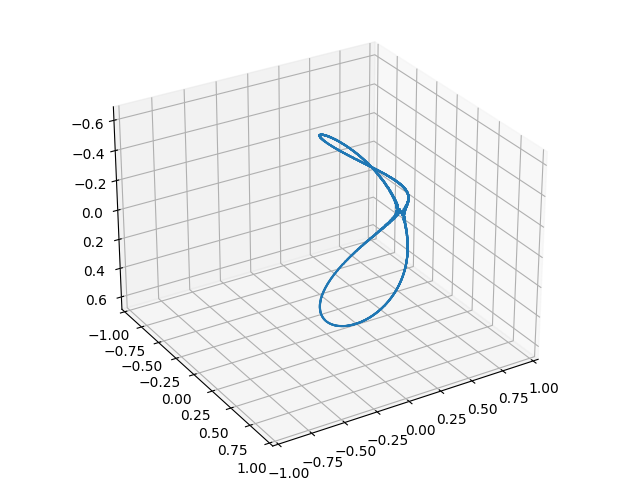

## About
This is educational project for space curve zero set computing on rectangular 3d-grid.
Designed as independent python package ready for use.

## Motivation
Author couldn't find python package with implemented ideas from 'Introduction to Numerical Continuation Methods'.

## Requirements
g++, make, python >= 3.7, see also requirements.txt

## Install
- From source, as a package
```
sudo python3 setup.py install
```

- Build manually
```
cd lib_src
[sudo] make
```
After that you can use package locally with appropriate import.
